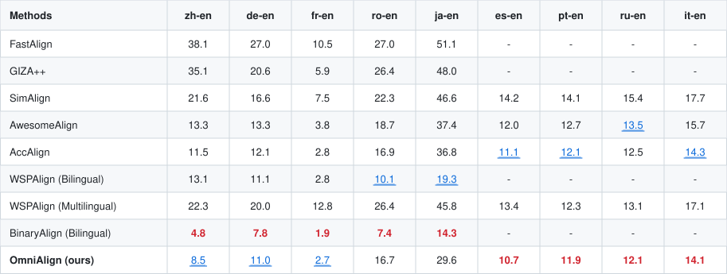
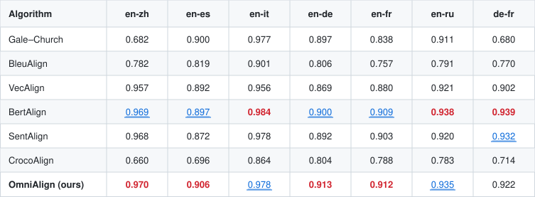

<p align="center">
  <a href="README_CN.md">中文</a>&nbsp;｜&nbsp;English
</p>

<p align="center">
  <a href="https://arxiv.org/abs/2608.18474">📄 Paper (arXiv)</a>&nbsp;|&nbsp;
  <a href="https://huggingface.co/WPS-Qingqiu/OmniAlign"> Hugging Face</a>
</p>

# OmniAlign

> Universal multilingual sequence alignment model for **sentence alignment** and **word alignment**.

**OmniAlign** is a universal multilingual alignment model designed to deliver efficient **sentence alignment** and **word alignment** through multi-stage training. It combines contextual word embeddings for token-level alignment with sentence embeddings for cross-lingual semantic matching, and progressively strengthens both through a four-stage training pipeline (pretrain → unsupervised → supervised → distillation).

- **Word alignment**: infers token similarity from contextual word embeddings and derives subword-level alignments.
- **Sentence alignment**: encodes source and target sentences into a shared vector space, then matches them with a dynamic-programming two-step approach — first pinning down approximate one-to-one anchors, then searching for all valid alignments under anchor constraints.
- **Four-stage training**: progressively strengthens both word and sentence embeddings through four training stages.

This model is the final checkpoint produced by the four-stage distillation pipeline, built on top of [`Alibaba-NLP/gte-multilingual-mlm-base`](https://huggingface.co/Alibaba-NLP/gte-multilingual-mlm-base).

> **This GitHub repository hosts inference code only.**  
> Model weights live on Hugging Face: [`WPS-Qingqiu/OmniAlign`](https://huggingface.co/WPS-Qingqiu/OmniAlign).  
> Download them into the local `OmniAlign/` directory before running the examples.

---

## Model Details

| Attribute | Value |
|---|---|
| **Model type** | Transformer encoder (GTE / NEW architecture) |
| **Base model** | [`Alibaba-NLP/gte-multilingual-mlm-base`](https://huggingface.co/Alibaba-NLP/gte-multilingual-mlm-base) |
| **Language** | Multilingual (optimized for zh–en, en–es, en–it, en–de, en–fr, en–ru, de–fr, and more) |
| **Params** | ~305M |
| **Max sequence length** | 8192 tokens |
| **Training** | Four-stage: pretrain → unsupervised → supervised → distillation |
| **License** | Apache 2.0 |

---

## Installation

Clone this repo, download the weights from Hugging Face into `OmniAlign/`, then install inference dependencies. Python 3.12 is recommended.

```bash
git clone https://github.com/MilkDargon/OmniAlign.git
cd OmniAlign
hf download WPS-Qingqiu/OmniAlign --local-dir OmniAlign
pip install -r example/requirements.txt
```

The example needs only inference dependencies (`torch`, `transformers`, `sentence_transformers`, `jieba`, `nltk`, `sentence_splitter`, `numpy`, `numba`, `faiss-cpu`).

If the `hf` command is missing, run `pip install -U huggingface_hub` first.

---

## Quick Start

From the cloned GitHub repo, set `--model_path` to the downloaded weights directory:

### Word Alignment

```bash
python example/example.py \
  --src "他没有遵守承诺" \
  --tgt "He broke promise" \
  --src_lang zh --tgt_lang en \
  --task word_align \
  --model_path OmniAlign
```

Output:

```
===Word Alignment Result ===
他  <==>  He
没有  <==>  broke
遵守  <==>  broke
承诺  <==>  promise
```

### Sentence Alignment

```bash
python example/example.py \
  --src "Large language models (LLMs) represent one of the most transformative breakthroughs in artificial intelligence over the past decade. Trained on terabytes of text data spanning books, websites, and academic papers, these models excel at capturing complex linguistic patterns, contextual nuances, and even logical reasoning." \
  --tgt "大语言模型（LLMs）是过去十年人工智能领域最具变革性的突破之一。这些模型基于涵盖书籍、网站与学术论文在内的万亿字节级文本数据进行训练，擅长捕捉复杂的语言模式、语境细微差异乃至逻辑推理能力。" \
  --src_lang en --tgt_lang zh \
  --task sent_align \
  --model_path OmniAlign
```

Output:

```
===Sentence Alignment Result ===
Large language models (LLMs) represent one of the most transformative breakthroughs in artificial intelligence over the past decade.  <==>  大语言模型（LLMs）是过去十年人工智能领域最具变革性的突破之一。
Trained on terabytes of text data spanning books, websites, and academic papers, these models excel at capturing complex linguistic patterns, contextual nuances, and even logical reasoning.  <==>  这些模型基于涵盖书籍、网站与学术论文在内的万亿字节级文本数据进行训练，擅长捕捉复杂的语言模式、语境细微差异乃至逻辑推理能力。
```

See [`example/README.md`](example/README.md) for the full list of arguments.

---

## Evaluation

### Word Alignment (AER, lower is better)

AER (Alignment Error Rate) on standard word alignment test sets. For each language pair, the best result is **red and bold**, and the second-best is **blue and underlined**.

<p align="center">
  
</p>

### Sentence Alignment (F1, higher is better)

F1 scores on standard sentence alignment test sets. For each language pair, the best result is **red and bold**, and the second-best is **blue and underlined**.

<p align="center">
  
</p>

---

## Citation

```bibtex
@misc{yang2026omnialign,
  title         = {OmniAlign: A Unified Multilingual Aligner for Word and Sentence Alignment},
  author        = {Mengpeng Yang and Jingxu Yang and Chao Chen and Tian Xia and Yabo Sun and Qiang Liu},
  year          = {2026},
  eprint        = {2608.18474},
  archivePrefix = {arXiv},
  primaryClass  = {cs.CL},
  url           = {https://arxiv.org/abs/2608.18474}
}
```

---

## License

This model is released under the [Apache License, Version 2.0](LICENSE).

*Read this in [中文](README_CN.md).*
