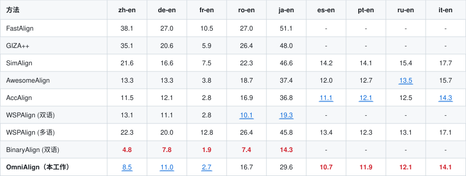
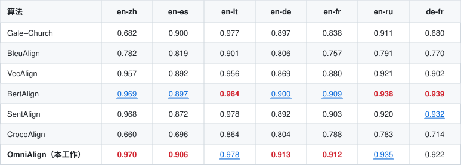

<p align="center">
  <a href="README.md">English</a>&nbsp;｜&nbsp;中文
</p>

<p align="center">
  <a href="https://arxiv.org/abs/2608.18474">📄 Paper (arXiv)</a>&nbsp;|&nbsp;
  <a href="https://huggingface.co/WPS-Qingqiu/OmniAlign"> Hugging Face</a>
</p>

# OmniAlign

> 面向**句对齐**与**词对齐**的通用多语言序列对齐模型。

**OmniAlign** 是一个通用多语言对齐模型，通过多阶段训练实现高效的**句对齐**与**词对齐**。它将用于 token 级对齐的上下文词嵌入与用于跨语言语义匹配的句嵌入相结合，并通过四阶段训练流程（预训练 → 无监督 → 有监督 → 蒸馏）逐步增强两者。

- **词对齐**：通过上下文词嵌入推断 token 相似度，并转换为子词级别的对齐。
- **句对齐**：将源句与目标句编码到共享向量空间，再通过动态规划两步法进行匹配——先确定近似的一对一锚点，再在锚点约束下搜索所有有效对齐。
- **四阶段训练**：通过四个训练阶段逐步增强词嵌入与句嵌入。

本模型是四阶段蒸馏流程产出的最终 checkpoint，基于 [`Alibaba-NLP/gte-multilingual-mlm-base`](https://huggingface.co/Alibaba-NLP/gte-multilingual-mlm-base) 构建。

> **本 GitHub 仓库只存放推理代码。**  
> 模型权重在 Hugging Face：[**WPS-Qingqiu/OmniAlign**](https://huggingface.co/WPS-Qingqiu/OmniAlign)。  
> 运行示例前，请先把权重下载到本地的 `OmniAlign/` 目录。

---

## 模型信息

| 属性 | 值 |
|---|---|
| **模型类型** | Transformer 编码器（GTE / NEW 架构） |
| **基础模型** | [`Alibaba-NLP/gte-multilingual-mlm-base`](https://huggingface.co/Alibaba-NLP/gte-multilingual-mlm-base) |
| **语言** | 多语言（针对 zh–en、en–es、en–it、en–de、en–fr、en–ru、de–fr 等优化） |
| **参数量** | 约 305M |
| **最大序列长度** | 8192 tokens |
| **训练方式** | 四阶段：预训练 → 无监督 → 有监督 → 蒸馏 |

---

## 安装

克隆本仓库，从 Hugging Face 将权重下载到 `OmniAlign/`，再安装推理依赖。推荐 Python 3.12。

```bash
git clone https://github.com/MilkDargon/OmniAlign.git
cd OmniAlign
hf download WPS-Qingqiu/OmniAlign --local-dir OmniAlign
pip install -r example/requirements.txt
```

example 仅需推理依赖（`torch`、`transformers`、`sentence_transformers`、`jieba`、`nltk`、`sentence_splitter`、`numpy`、`numba`、`faiss-cpu`）。

若没有 `hf` 命令，先执行 `pip install -U huggingface_hub`。

---

## 快速开始

在克隆下来的仓库中运行，并将 `--model_path` 指向刚下载的权重目录：

### 词对齐

```bash
python example/example.py \
  --src "他没有遵守承诺" \
  --tgt "He broke promise" \
  --src_lang zh --tgt_lang en \
  --task word_align \
  --model_path OmniAlign
```

输出：

```
===Word Alignment Result ===
他  <==>  He
没有  <==>  broke
遵守  <==>  broke
承诺  <==>  promise
```

### 句对齐

```bash
python example/example.py \
  --src "Large language models (LLMs) represent one of the most transformative breakthroughs in artificial intelligence over the past decade. Trained on terabytes of text data spanning books, websites, and academic papers, these models excel at capturing complex linguistic patterns, contextual nuances, and even logical reasoning." \
  --tgt "大语言模型（LLMs）是过去十年人工智能领域最具变革性的突破之一。这些模型基于涵盖书籍、网站与学术论文在内的万亿字节级文本数据进行训练，擅长捕捉复杂的语言模式、语境细微差异乃至逻辑推理能力。" \
  --src_lang en --tgt_lang zh \
  --task sent_align \
  --model_path OmniAlign
```

输出：

```
===Sentence Alignment Result ===
Large language models (LLMs) represent one of the most transformative breakthroughs in artificial intelligence over the past decade.  <==>  大语言模型（LLMs）是过去十年人工智能领域最具变革性的突破之一。
Trained on terabytes of text data spanning books, websites, and academic papers, these models excel at capturing complex linguistic patterns, contextual nuances, and even logical reasoning.  <==>  这些模型基于涵盖书籍、网站与学术论文在内的万亿字节级文本数据进行训练，擅长捕捉复杂的语言模式、语境细微差异乃至逻辑推理能力。
```

完整参数列表见 [`example/README_zh.md`](example/README_zh.md)。

---

## 评测结果

### 词对齐（AER，越低越好）

在标准词对齐测试集上的 AER（对齐错误率）。每个语言对中，**最优结果红色加粗**，**次优结果蓝色下划线**。

<p align="center">
  
</p>

### 句对齐（F1，越高越好）

在标准句对齐测试集上的 F1 分数。每个语言对中，**最优结果红色加粗**，**次优结果蓝色下划线**。

<p align="center">
  
</p>

---

## 引用

```bibtex
@misc{yang2026omnialign,
  title         = {OmniAlign: A Unified Multilingual Aligner for Word and Sentence Alignment},
  author        = {Mengpeng Yang and Jingxu Yang and Chao Chen and Tian Xia and Yabo Sun and Qiang Liu},
  year          = {2026},
  eprint        = {2608.18474},
  archivePrefix = {arXiv},
  primaryClass  = {cs.CL},
  url           = {https://arxiv.org/abs/2608.18474}
}
```

---

## 许可协议

本模型基于 [Apache License, Version 2.0](LICENSE) 发布。

*English version: [README.md](README.md).*
